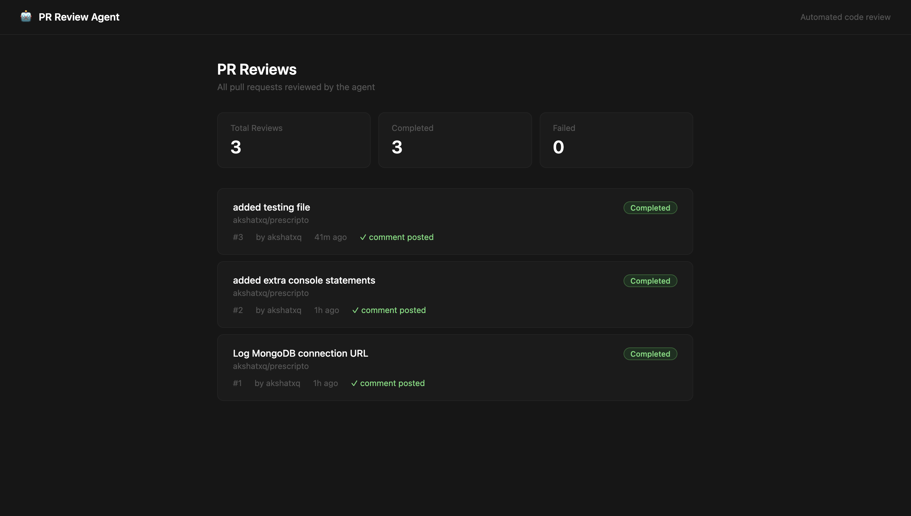
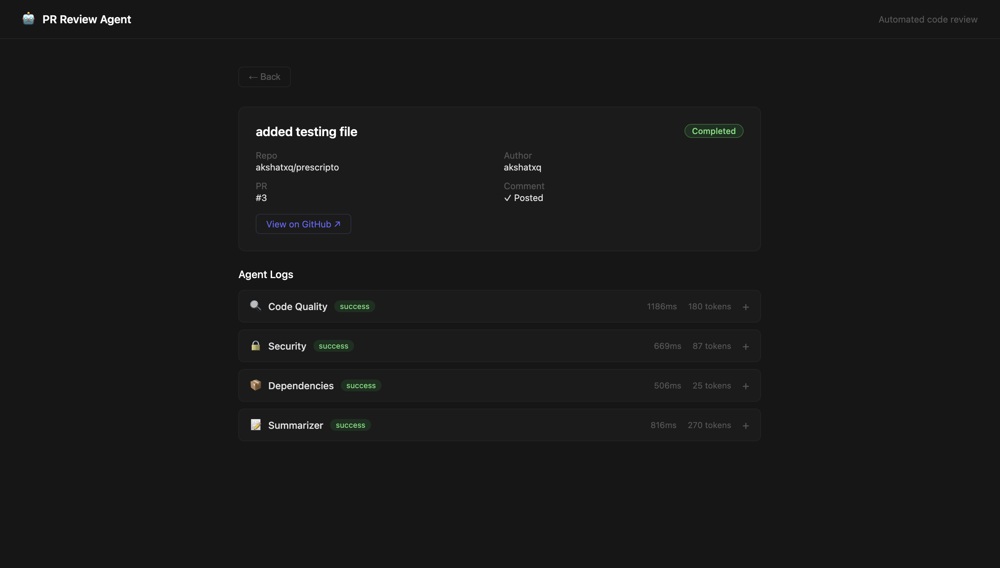

# PR Review Agent

An autonomous multi-agent system that reviews GitHub Pull Requests automatically. When a PR is opened, three specialized AI agents analyze the code diff in parallel — code quality, security, and dependencies — then post a structured review comment directly on the PR.

## Demo





## How It Works

```
GitHub PR opened
       │
       ▼
Webhook received (HMAC-SHA256 verified)
       │
       ▼
Fetch PR diff via GitHub API
       │
       ├──────────────────────────────┐──────────────────────────────┐
       ▼                              ▼                              ▼
Code Quality Agent            Security Agent              Dependency Agent
       │                              │                              │
       └──────────────────────────────┘──────────────────────────────┘
                                      │
                                      ▼
                              Summarizer Agent
                                      │
                                      ▼
                         Post comment on GitHub PR
                                      │
                                      ▼
                            Save run to Supabase
```

## Tech Stack

| Layer | Technology |
|-------|-----------|
| Agent Orchestration | LangGraph.js |
| LLM Framework | LangChain.js |
| AI Model | Llama 3.3 70B via Groq (free tier) |
| Backend | Node.js + Express.js |
| Webhook Integration | GitHub Webhooks + Octokit |
| Database | Supabase (PostgreSQL) |
| Frontend | React.js (Vite) |
| Deployment | Railway (backend) + Vercel (frontend) |

## Agent Architecture

| Agent | Responsibility |
|-------|---------------|
| `code_quality_agent` | Naming conventions, function length, complexity, dead code, error handling |
| `security_agent` | Hardcoded secrets, SQL injection, unvalidated inputs, unsafe patterns |
| `dependency_agent` | New packages, version changes, known vulnerabilities, risky version ranges |
| `summarizer_agent` | Collects all outputs, formats final markdown comment, posts to GitHub |

All three analysis agents run **in parallel** using LangGraph's fan-in pattern — execution time is bounded by the slowest agent, not the sum of all three.

## Database Schema

```
repos
 └── pr_reviews (repo_id → repos.id)
      └── agent_runs (review_id → pr_reviews.id)
```

## Project Structure

```
pr-review-agent/
├── backend/
│   └── src/
│       ├── agents/
│       │   ├── codeQualityAgent.js
│       │   ├── securityAgent.js
│       │   ├── dependencyAgent.js
│       │   └── summarizerAgent.js
│       ├── graph/
│       │   └── reviewGraph.js
│       ├── middleware/
│       │   └── validateWebhook.js
│       ├── routes/
│       │   ├── webhook.js
│       │   └── reviews.js
│       ├── services/
│       │   ├── githubService.js
│       │   ├── supabaseService.js
│       │   └── groqService.js
│       └── utils/
│           ├── formatComment.js
│           └── logger.js
└── frontend/
    └── src/
        ├── components/
        │   ├── Navbar.jsx
        │   ├── ReviewCard.jsx
        │   ├── AgentLogPanel.jsx
        │   └── StatusBadge.jsx
        ├── pages/
        │   ├── Dashboard.jsx
        │   └── ReviewDetail.jsx
        └── services/
            └── api.js
```

## Local Setup

### Prerequisites

- Node.js v20+
- A GitHub account
- Supabase account (free)
- Groq API key (free — [console.groq.com](https://console.groq.com))
- GitHub Personal Access Token (classic, `repo` scope)

### 1. Clone the repo

```bash
git clone https://github.com/akshatxq/pr-review-agent.git
cd pr-review-agent
```

### 2. Install dependencies

```bash
cd backend && npm install
cd ../frontend && npm install
```

### 3. Set up Supabase

Run the following SQL in your Supabase SQL Editor:

```sql
create table repos (
  id uuid primary key default gen_random_uuid(),
  github_repo_id bigint unique not null,
  repo_full_name text not null,
  owner text not null,
  created_at timestamptz default now()
);

create table pr_reviews (
  id uuid primary key default gen_random_uuid(),
  repo_id uuid references repos(id),
  pr_number integer not null,
  pr_title text,
  pr_author text,
  pr_url text,
  status text default 'pending',
  comment_posted boolean default false,
  github_comment_id bigint,
  created_at timestamptz default now(),
  completed_at timestamptz
);

create table agent_runs (
  id uuid primary key default gen_random_uuid(),
  review_id uuid references pr_reviews(id),
  agent_name text,
  input_tokens integer,
  output_tokens integer,
  execution_time_ms integer,
  output text,
  status text,
  error_message text,
  created_at timestamptz default now()
);
```

### 4. Configure environment variables

```bash
cp backend/.env.example backend/.env
cp frontend/.env.example frontend/.env
```

Fill in `backend/.env`:

```
PORT=3000
GROQ_API_KEY=
GITHUB_WEBHOOK_SECRET=
GITHUB_TOKEN=
SUPABASE_URL=
SUPABASE_SERVICE_ROLE_KEY=
```

Fill in `frontend/.env`:

```
VITE_API_BASE_URL=http://localhost:3000
```

### 5. Set up GitHub webhook (local development)

Install smee:
```bash
npm install -g smee-client
```

Get a channel URL from [smee.io](https://smee.io) and start forwarding:
```bash
smee --url https://smee.io/your-channel --target http://localhost:3000/webhook/github
```

Register the smee URL as a webhook in your GitHub repo:
- Go to repo → Settings → Webhooks → Add webhook
- Payload URL: your smee URL
- Content type: `application/json`
- Secret: same value as `GITHUB_WEBHOOK_SECRET` in your `.env`
- Events: Pull requests only

### 6. Run locally

```bash
# terminal 1
cd backend && npm run dev

# terminal 2
cd frontend && npm run dev
```

Dashboard: [http://localhost:5173](http://localhost:5173)

## Deployment

### Backend — Railway

1. Push code to GitHub
2. Create new project on [railway.app](https://railway.app)
3. Connect your GitHub repo, select the `backend/` directory
4. Add all env vars from `backend/.env` in Railway's Variables tab
5. Railway auto-deploys on every push to main

### Frontend — Vercel

1. Create new project on [vercel.com](https://vercel.com)
2. Connect your GitHub repo, set root directory to `frontend/`
3. Add `VITE_API_BASE_URL` pointing to your Railway backend URL
4. Vercel auto-deploys on every push to main

After deploying backend, update your GitHub webhook URL from the smee URL to the Railway URL.

## Key Design Decisions

**Why LangGraph over plain Promise.all?**
LangGraph provides explicit state management across the agent graph. State is accumulated via reducers as each node completes — making it observable, debuggable, and extensible. Adding a new agent is one new node, not a refactor.

**Why respond to GitHub before running agents?**
GitHub webhooks expect a response within 10 seconds or they mark the delivery as failed and retry. LLM agents take longer than that. Responding immediately and processing async is the correct production pattern.

**Why HMAC-SHA256 with timingSafeEqual?**
Regular string comparison short-circuits on mismatch — vulnerable to timing attacks. `timingSafeEqual` always takes constant time regardless of where the mismatch occurs.

**Why Supabase over raw PostgreSQL?**
Supabase is PostgreSQL under the hood — all standard SQL, foreign keys, and joins work as expected. It adds auth and a JS client that reduces boilerplate, letting focus stay on agent logic.

## License

MIT